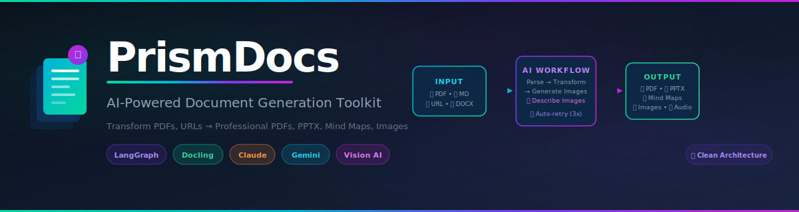

<div align="center">



<br/>

<p>
  <strong>🚀 Transform any content into professional documents with AI</strong>
  <br/>
  <em>From Research Papers to Pitch Decks • From Web Articles to Study Guides</em>
</p>

[](https://prism-docs-pink.vercel.app/generate)
[](https://opensource.org/licenses/MIT)

<br/>

</div>

---

## 📖 Documentation

Detailed documentation has been moved to the `docs/` directory:

- [✨ **Use Cases**](docs/USE_CASES.md): Solutions for executives, students, developers, and creators.
- [🏗️ **Architecture**](docs/ARCHITECTURE.md): System overview, clean architecture, and tech stack.
- [📡 **API Reference**](docs/API.md): API usage, endpoints, and integration guide.
- [🛠️ **Development**](docs/DEVELOPMENT.md): Setup guide, testing, and contribution limits.

---

## 🚀 Key Features

- **Multi-Format Input**: PDF, URLs, Markdown, Images (OCR), DOCX.
- **Professional Output**: PDF Reports, PPTX Slides, Mind Maps, Markdown, Edited Images.
- **Interactive Studios**:
  - **Idea Canvas**: Visual decision trees.
  - **Mind Map Studio**: Visualize complex concepts.
  - **Audio Studio**: Turn docs into Podcasts (Beta).
- **AI-Powered**: Uses Claude, Gemini, and OpenAI (BYO Keys).
- **Enterprise Ready**: Docker support, self-hosting, and privacy-focused.

---

## ⚡ Quick Start

### Option 1: Web UI (Fastest)

**Run with Docker Compose:**

```bash
git clone https://github.com/nitishkmr005/PrismDocs.git
cd PrismDocs
docker-compose up --build
```

Open [http://localhost:3000](http://localhost:3000)

### Option 2: Deploy to Cloud

- **Backend:** Deploy to [Render](https://render.com) using `backend/render.yaml`
- **Frontend:** Deploy to [Vercel](https://vercel.com) using `vercel.json`

For local development setup, see [docs/DEVELOPMENT.md](docs/DEVELOPMENT.md).

---

## 🧩 Tech Stack

- **Frontend**: Next.js 16, TypeScript, Tailwind CSS
- **Backend**: FastAPI, Python 3.12, LangGraph, Docling
- **Services**: Supabase (Auth/DB), Railway (Backend Hosting), Vercel (Frontend)

---

## 🗺️ Roadmap

- [x] **Mind Maps**: Interactive viewer and export.
- [x] **Podcast Generation**: Multi-speaker Audio (Beta).
- [ ] **Template Library**: Pre-built templates for resumes and papers.
- [ ] **PyPI Package**: `pip install prismdocs` (Planned).

---

## 📄 License

MIT License - See [LICENSE](LICENSE) file for details.

<div align="center">
  <sub>Built with ❤️ by Nitish Harsoor</sub>
</div>
